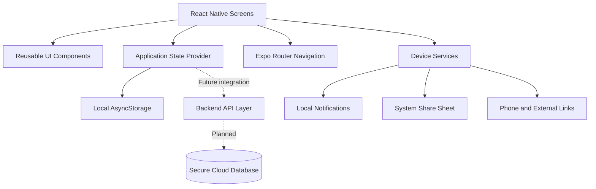

# Exhibit C — Transforming Grief Application Technical Documentation

## Transforming Grief / Plekei

| Project information | Details |
| --- | --- |
| Project name | **Transforming Grief** |
| Application name | **Plekei** |
| Project type | Cross-platform emotional wellbeing and grief-support application |
| Primary developer | **Sofiia Maksymchuk** |
| Development role | Project creator, product designer, frontend developer, and application architect |
| Development start | **Late June 2026** |
| Documented milestone | Approximately **40% of the planned application scope** |
| Target platforms | **iOS and Android**, with a web-compatible development build |
| Repository | [github.com/Sofiia22/emotional-support-app](https://github.com/Sofiia22/emotional-support-app) |
| GitHub profile | [github.com/Sofiia22](https://github.com/Sofiia22) |

## Overview

**Transforming Grief** is the development project behind **Plekei**, a private emotional wellbeing application designed to provide a calm and structured space for people experiencing grief, emotional distress, or difficult life transitions.

Plekei combines reflective journaling, mood check-ins, guided breathing, grounding exercises, supportive reading, and access to crisis or emergency resources. The product is designed as a wellbeing support tool and is not represented as therapy, diagnosis, medical care, or an emergency service.

The documented milestone began in late June 2026 and represents the first functional application foundation: approximately 40% of the originally planned product scope. Later commits in the repository may contain functionality developed after this milestone.

## Developer

**Sofiia Maksymchuk** is the primary developer and creator of Transforming Grief / Plekei. Her responsibilities include:

- defining the product concept and user experience;
- translating the visual design into a working application;
- creating the frontend architecture and reusable interface components;
- implementing navigation and core user flows;
- building multilingual application content;
- creating local state and privacy-conscious data handling;
- preparing the codebase for future backend integration;
- testing the application across mobile and web-compatible environments;
- maintaining the GitHub repository and technical documentation.

## Technology Stack

### Core technologies

- **TypeScript** — typed application logic, data models, and component interfaces;
- **React** — component-based user interface and state-driven rendering;
- **React Native** — shared mobile interface implementation;
- **Expo** — development runtime, mobile platform tooling, build configuration, and device APIs;
- **Expo Router** — file-based navigation and route organization;
- **Expo Audio** — cross-platform private voice recording and playback;
- **Expo FileSystem** — on-device persistence for native audio files;
- **AsyncStorage** — local persistence for the current development milestone;
- **React Native Reanimated** — splash and welcome-screen motion;
- **ESLint** — static code-quality checks.

## Project Architecture

Plekei uses a feature-oriented frontend architecture. Screen-level features are separated from shared state, navigation, reusable components, localization, and device integrations.



### Frontend architecture

The frontend is implemented as a React Native application shared between iOS and Android. It includes:

- route components in `src/app`;
- feature screens in `src/features`;
- reusable layout and UI components in `src/components`;
- translations, state, navigation helpers, notifications, and utility functions in `src/shared`;
- static image and vector assets in `src/assets` and `assets`;
- Expo application configuration in `app.json`;
- TypeScript and lint configuration at the repository root.

Application state is exposed through a React context provider. Feature screens consume this state without directly depending on storage implementation details. This separation allows local persistence to be replaced or supplemented by an authenticated backend later.

### Backend architecture and integration

At the documented 40% milestone, Plekei does **not** use a production backend. Authentication is a local demonstration flow, and wellbeing data is stored on the user's device.

The current local data model includes:

- selected application language;
- local user profile;
- current mood and mood history;
- journal entries;
- private voice-journal recordings stored locally on the device;
- listening progress, saved audio references, and community voice drafts;
- breathing-session count;
- saved reading items;
- reminder preferences;
- manually selected support region.

No artificial intelligence service, advertising network, analytics platform, or cloud database is connected at this milestone.

### Planned backend/API integration

If cloud accounts are required, the planned backend layer will provide:

- account registration and secure authentication;
- email verification and password recovery;
- encrypted storage and synchronization;
- account and data deletion;
- API validation and authorization;
- data-retention controls;
- optional synchronization between devices.

The frontend will communicate with the backend through a dedicated service layer rather than making network requests directly inside screen components.

```text
Screen → State/Service Action → API Client → Authenticated Backend → Database
                                  ↓
                         Validated API Response
                                  ↓
                       Updated Frontend State
```

Until that backend is implemented, local storage remains the active persistence layer and the application can operate without a server.

## Application Structure

```text
emotional-support-app/
├── assets/                         # Native application icons and images
├── docs/
│   ├── PRIVACY_POLICY.md           # Draft privacy documentation
│   ├── ROADMAP.md                  # Development milestones
│   └── SAFETY_RESOURCES.md         # Crisis-resource verification notes
├── scripts/
│   └── wellbeing.test.mjs          # Core logic tests
├── src/
│   ├── app/                        # Expo Router routes
│   │   ├── _layout.tsx             # Root navigation and application provider
│   │   ├── index.tsx               # Splash and welcome entry point
│   │   ├── auth.tsx                # Registration and sign-in route
│   │   ├── home.tsx                # Main wellbeing dashboard
│   │   ├── journal.tsx             # Private journal route
│   │   ├── library.tsx             # Offline reading route
│   │   ├── breathe.tsx             # Breathing exercise route
│   │   ├── support.tsx             # Support resources route
│   │   ├── settings.tsx            # Preferences and data controls
│   │   └── privacy.tsx             # In-app privacy notice
│   ├── assets/                     # Feature-level images and vector assets
│   ├── components/
│   │   ├── common/                 # Shared controls such as language selection
│   │   ├── layout/                 # Responsive application scaffold
│   │   └── ui/                     # Reusable text, screen, and button components
│   ├── features/
│   │   ├── auth/                   # Local authentication interface
│   │   ├── breathe/                # Breathing and grounding experience
│   │   ├── home/                   # Mood check-in and dashboard
│   │   ├── journal/                # Journal management
│   │   ├── library/                # Offline supportive content
│   │   ├── privacy/                # Privacy explanation screen
│   │   ├── settings/               # Reminder and data preferences
│   │   ├── splash/                 # Animated application splash
│   │   ├── support/                # Crisis and emergency resources
│   │   └── welcome/                # Onboarding welcome experience
│   └── shared/
│       ├── i18n/                   # English, Ukrainian, and Russian content
│       ├── navigation/             # Authentication-route protection
│       ├── notifications/          # Local reminder scheduling
│       ├── state/                  # Persistent application state
│       ├── theme/                  # Shared colors, spacing, and typography
│       └── utils/                  # Mood and reminder-time logic
├── app.json                        # Expo platform configuration
├── package.json                    # Dependencies and development commands
└── tsconfig.json                   # TypeScript configuration
```

## Navigation and User Flows

Expo Router provides file-based navigation. The primary flow is:

```text
Splash
  → Welcome
    → Create Local Profile / Sign In
      → Home Dashboard
        ├── Mood Check-In
        ├── Private Journal
        ├── Breathing and Grounding
        ├── Supportive Reading
        ├── Crisis / Emergency Support
        └── Profile, Language, Privacy, and Settings
```

Protected application screens use a shared navigation guard. If no local profile is available, the user is returned to the welcome/authentication flow.

The persistent bottom navigation provides direct access to Home, Journal, Library, Breathe, and Support.

## Implemented Features

The following foundation was completed or functional at the documented milestone:

- Expo and React Native project foundation;
- TypeScript configuration and typed components;
- animated splash and welcome experience;
- local registration and sign-in demonstration;
- responsive navigation and reusable screen layout;
- English, Ukrainian, and Russian localization foundation;
- mood selection and local wellbeing state;
- private local journal foundation;
- guided 4–4–4 breathing exercise;
- 5–4–3–2–1 grounding guidance;
- support and emergency-information screen;
- local persistence using AsyncStorage;
- iOS, Android, and web-compatible routing;
- privacy-conscious architecture with no AI or analytics connection;
- lint, TypeScript, and static web-build validation.

### Post-milestone implementation now present in the repository

- structured private writing journal with categories, editing, search, and deletion;
- private voice journal with record, pause, resume, preview, save, playback, and deletion;
- persistent local voice recordings on iOS and Android using Expo Audio and Expo FileSystem;
- IndexedDB audio persistence for the web version;
- unified Listen hub with six content libraries, saved items, and listening progress;
- local Share Your Voice drafts without automatic publishing or server upload;
- localized Listen and journal experiences in English, Ukrainian, and Russian.

## Features in Development

The following items were planned or in development beyond the documented 40% milestone:

- production user authentication;
- secure backend and encrypted cloud synchronization;
- email verification and password recovery;
- account deletion and server-side data-retention controls;
- expanded journal search, editing, deletion, and export workflows;
- longer mood-history views and visual progress reporting;
- expanded professionally reviewed grief-support content;
- offline audio guidance for breathing exercises;
- exact native reminder-time selection and notification deep links;
- broader country-specific crisis-resource coverage;
- biometric or PIN protection for local content;
- complete screen-reader, text-scaling, contrast, and reduced-motion review;
- component and end-to-end automated testing;
- final native icons, store screenshots, privacy disclosures, and release metadata;
- App Store and Google Play release builds.

## Cross-Platform Support

Plekei is designed from a shared React Native codebase for:

- **iOS** — Expo development build, iOS simulator, and future App Store build;
- **Android** — Expo development build, Android emulator, and future Google Play build;
- **Web** — static development and demonstration build.

Platform-specific integrations are isolated where necessary. For example, local system notifications are intended for iOS and Android, while the web build displays an explanatory fallback. Responsive layouts use shared React Native styles instead of separate mobile codebases.

## Development Progress

### Exhibit milestone status: approximately 40%

The 40% estimate records the foundational development stage covered by this exhibit. At that stage:

- the application architecture was established;
- the primary interface and navigation were operational;
- the central wellbeing experiences had functional implementations;
- data was stored locally;
- backend services and production release infrastructure remained incomplete.

This estimate is a project-planning assessment rather than an automated measurement. The GitHub repository may show later development completed after the milestone documented here.

## Development and Verification Commands

Install dependencies:

```bash
npm install
```

Start the Expo development environment:

```bash
npx expo start
```

Run platform-specific development modes:

```bash
npm run ios
npm run android
npm run web
```

Run available quality checks:

```bash
npm test
npm run lint
npx tsc --noEmit
```

Create a static web build:

```bash
CI=1 npx expo export --platform web
```

## Repository and Supporting Evidence

- **Repository:** [Sofiia22/emotional-support-app](https://github.com/Sofiia22/emotional-support-app)
- **Primary branch:** [`main`](https://github.com/Sofiia22/emotional-support-app/tree/main)
- **Developer profile:** [Sofiia22](https://github.com/Sofiia22)
- **Source evidence:** commit history, dated source files, configuration, tests, and technical documentation contained in the repository
- **Development start represented by this exhibit:** late June 2026
- **Documented progress milestone:** approximately 40%

Screenshots may be attached separately as supporting exhibits showing the splash screen, welcome/authentication flow, home dashboard, journal, breathing exercise, multilingual interface, and support screen.

## Safety and Scope Notice

Plekei is an emotional wellbeing and self-reflection tool. It does not provide medical advice, diagnosis, therapy, or emergency response. Crisis and emergency information must be professionally reviewed and re-verified for each launch region before public release.

---

- **Document title:** Exhibit C — Transforming Grief Application Technical Documentation
- **Project:** Transforming Grief
- **Application:** Plekei
- **Primary developer:** Sofiia Maksymchuk
- **Development commenced:** Late June 2026
